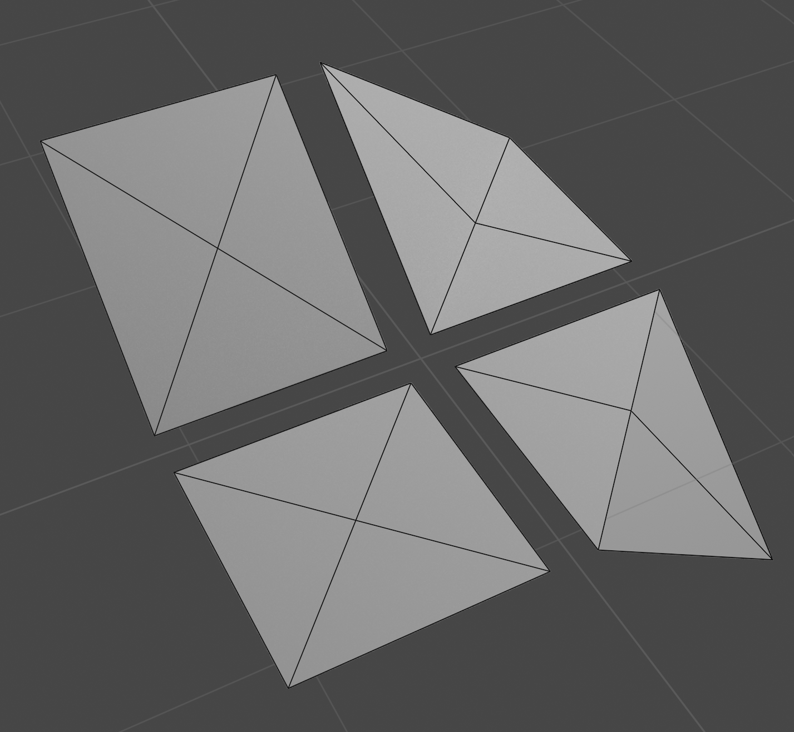

# SC2K-Style Terrain Renderer

This project was created in connection with an [answer](https://stackoverflow.com/questions/70642140/terrain-map-three-js/70644836#70644836) I posted on Stack Overflow, which related to rendering terrain in the style of Maxis's _SimCity 2000_.  Specifically, the poster there wanted to know how to render the blocky tesselation of that game's maps together with the geometric hills that characterize the game's visual style.  The following screenshot is representative of the visual style.

_Image credit: [Moby Games](https://www.mobygames.com/images/shots/l/313821-simcity-2000-dos-screenshot-terrain-editor.png)_

This project generates an elevation map and moisture map using Perlin noise, providing similar data to a user's editing the map, as in the Stack Overflow poster's question.  From those maps, it generates a triangle mesh for rendering in [Three.js](https://threejs.org/).

The basis for the mesh is an observation that all of the map's variety comprises just four shapes for the cells, each of which can be realized by building a square from four triangles.

The code that builds the mesh loops through the cells, comparing the elevation of each to its eight neighbors.  In the case of cells at the edge of the map, which have no neighbors, the mesh builder uses mock cells that have the same elevation as the cell under consideration.  By examining which, if any, of the neighboring cells is higher than the cell under consideration, the mesh builder establishes a shape and orientation for the cell under consideration and adds appropriate triangles to the mesh.

_Copyright © 2022 Philip Nichols.  Made available under the [MIT License](./LICENSE).  Attribution, as well as notice of usage, are appreciated but not required._

SimCity _and_ SimCity 2000 _are trademarks of Electronic Arts Inc._